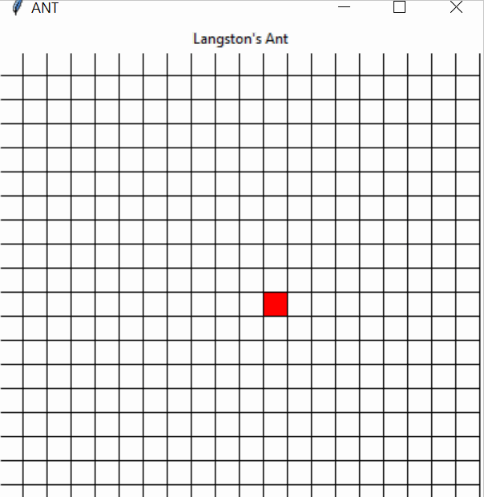
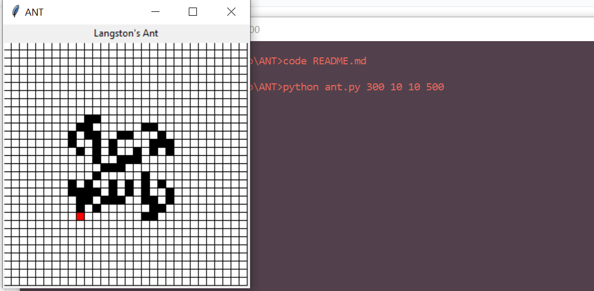

# ANT
An implementation of the Langston's Ant automata using Python and Tkinter



This program was made mostly to refresh some of my knowledge on Python including classes, closures, list comphrensions and command line arguments.

The overall algorithm was derived from the [wikipedia page on Langston's Ant](https://en.wikipedia.org/wiki/Langton%27s_ant).

## Usage
```python ant.py [board size] [square size] [delay in ms] [number of steps of algorithm] ```


*Image of Ant Program after 300 steps*

### Useful Links
[Python Docs](https://docs.python.org/3/)
